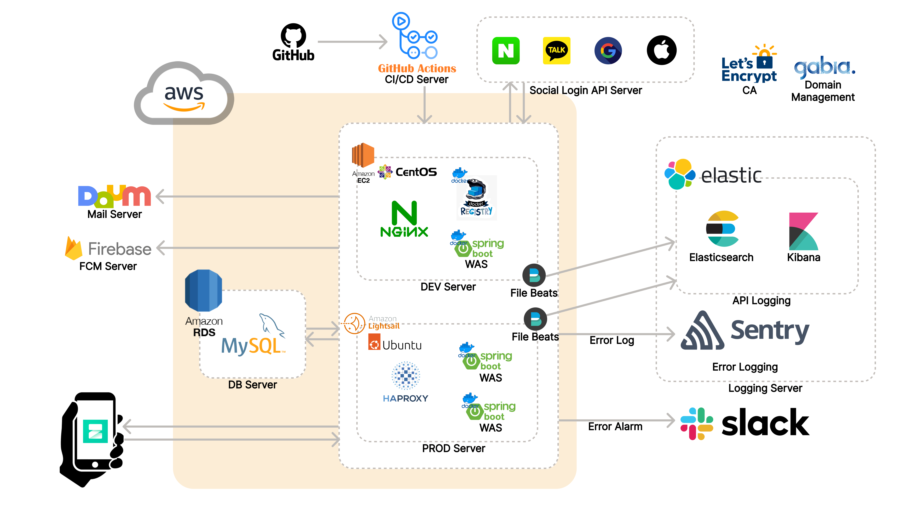

<h1 align="center"> ZeroriServer </h1>  

   

  ZERORI API Server Application. Built with Spring Boot.

  

## Table of Contents

- [Introduction of ZERORI](#introduction-of-zerori)
- [Features](#features)
- [Server Technologies](#server-technologies)
- [Server Infra Structure](#infra-structure)
- [Server API](#server-api)
- [Contributors (Server Team)](#contributors-(server-team))

## Introduction of ZERORI
‘Zerori’ is a platform that makes those who are not familiar with environmental protection to practice zero-waste activities sustainably. Users become residents of ‘Zerori’ and practice zero-waste activities to create a village where people and endangered animals coexist. Users who have experienced that a small practice can make their own village safe will constantly plan and execute zero-waste activities. Also, They can find eco-friendly information more easily with zero-waste activities categorized into themes and tags. In ‘Zerori’, Users can share their activities and support each other.

**Available for iOS.**

## Features
A few of the things you can do with ZERORI:

- Easily search for any zero-waste activities
- Plan and execute zero-waste activities
- Check zero-waste activities cumulative statistics
- View zero-waste activities execution record by users, days, activities
- Bookmark zero-waste activities
- Press the heart about other user's zero-waste activities execution record
- Report inapposite zero-waste activities execution record
- Decorate the island by inviting endangered animals
- Get letters from endangered animals
- Open new islands
- Inquiring about services and suggesting eco-friendly activities

## Server Technologies

<table>
  <tr><th rowspan="11">Back-end</th><td>Language</td><td>Java 11</td></tr>
  <tr><td>Main Framework</td><td>Spring Boot 2.5.5 Spring MVC</td></tr>
  <tr><td>ORM</td><td>Spring Data JPA QueryDSL JPA</td></tr>
  <tr><td>Authorization</td><td>Spring Security Spring Session JWT</td></tr>
  <tr><td>Open API</td><td>Naver API Kakao API Apple API Google API</td></tr>
  <tr><td>Test</td><td>Junit5</td></tr>
  <tr><td>API Documentation</td><td>Swagger</td></tr>
  <tr><td>Monitoring</td><td>Sentry Elastic APM</td></tr>
  <tr><td>Database</td><td>MySQL 8.0.23</td></tr>
  <tr><td>Build Tool</td><td>Gradle</td></tr>
  <tr><td>ETC Library</td><td>OpenFeign (for REST client) Firebase Admin SDK (for push message) Tika (for image file's extension signature verification) Aho-Corasick (for profanity test)</td></tr>

  <tr><th rowspan="6">DevOps</th><td>Cloud (AWS)</td><td>EC2 Ligtsail RDS S3</td>
  <tr><td>OS</td><td>CentOS 7.8 Ubuntu 20.04</td></tr>
  <tr><td>CI/CD</td><td>Git Github Action Docker Docker Registry</td></tr>
  <tr><td>Firewall</td><td>iptables UFW</td></tr>
  <tr><td>Reverse Proxy</td><td>NginX HAProxy</td></tr>
  <tr><td>Logging</td><td>Elastic Search File Beat Kibana</td></tr>
</table>

## Server Infra Structure

   

## Server API
[Go to ZERORI Server API Documentation](https://dev.zero-ri.com/swagger-ui/index.html)

## Contributors (Server Team)

  | 
---|---
[Yeo-kyeong Yun ](https://github.com/YunYeoKyeong99) |[Hyo-joo Jo](https://github.com/JoHyoju04)